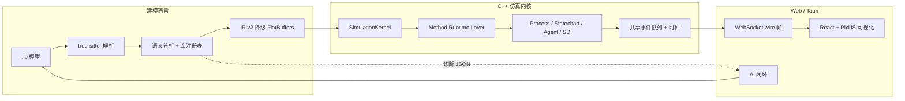

# LogicPilot

AI 原生 · Web 化 · 高性能的**多方法建模仿真平台**（Simulation OS）。

用一套薄 DSL 描述模型，C++ 内核高速执行，浏览器/Tauri 桌面端拖拽建模与实时
可视化，AI 生成 → 编译修复 → 运行校验闭环开箱即用。技术路线上与
AnyLogic / Simio 对齐，但采用更现代的 **DSL → IR → C++ Runtime → Web/Tauri
IDE** 分层，而不是 Java/生成代码。

> 定位声明：LogicPilot 是**建模仿真平台**（离散事件、DEVS 原子、Agent 群体、
> 连续 ODE，多方法在同一内核/事件队列中组合），不是通用编程语言，也不是
> 逻辑推理引擎。语言边界见 [DSL 冻结契约](docs/specs/dsl-freeze.md)。

## 架构总览



分层原则：**C++ 内核负责全部编译与仿真步进**，浏览器只消费二进制状态快照
（`wire.fbs` 的 Tick/Counters 帧）与渲染指令；AI 闭环只读写 DSL 与结构化
诊断，不接触内核内部。

## 快速开始

### 环境要求

- CMake ≥ 3.25、Ninja、MSVC（Windows）/ clang（Linux）
- vcpkg（`vcpkg.json` 声明依赖，经 `CMakePresets.json` 自动接入）
- Node.js ≥ 20 + pnpm 9（Web IDE 与 AI 脚本）；Rust（可选，桌面端 Tauri）

### 构建内核

```powershell
cmake --preset windows-msvc-dev      # Linux 用 linux-clang-dev
cmake --build --preset windows-msvc-dev
ctest --preset windows-msvc-dev      # 200+ 测试
```

### 第一条仿真

```powershell
# 编译 + 运行 M/M/1 示例
lpcli compile examples/mm1.lp -o build/mm1.ir.bin
lpcli run --model-file build/mm1.ir.bin --seed 42 --reps 3 --arrivals 500 --warmup 50

# 或用内置模型 + 复现级并行
lpcli run --model built-in:mm1 --reps 30 --threads 8
```

### Web IDE 与 AI

```powershell
lpcli serve examples/mm1.lp --port 8089   # 启动仿真网关
pnpm install
pnpm --filter @logicpilot/ide dev          # http://localhost:5173
```

在 IDE 里可以：拖拽建模（39 个 process 块 + presentation/statechart/action
库）、DSL 编译诊断、实时运行可视化、AI 面板生成/优化/归因。桌面客户端见
[desktop/README.md](desktop/README.md)。

## 仓库结构

| 目录 | 内容 |
| --- | --- |
| `dsl/` | tree-sitter 文法（生成物入库，ADR-0005）、C++ 编译器（parser/semantic/lowering/registry）、lp-lsp 语言服务器 |
| `kernel/` | C++ 仿真内核：core（时钟/调度器/随机）、runtime（Method Runtime Layer + SimulationKernel）、devs（引擎）、agent（ECS）、state、apps（lpcli / lp-server） |
| `methods/` | 方法运行时插件库（`process`、`statechart`） |
| `libraries/` | DSL 库注册表（`process.lplib`、行业示例 `manufacturing.lplib`） |
| `schemas/` | 冻结契约 F1（IR v2）/ F2（wire 遥测），flatc 生成 |
| `web/` | Web IDE（React + zustand + PixiJS）、editor 图文档包、protocol/renderer2d |
| `desktop/` | Tauri 2 桌面壳（Rust），嵌入同一 Web IDE |
| `examples/` | 示例模型（mm1、制造线、call-center 工程等） |
| `bench/` | 性能门禁基准（scheduler/RNG/MM1/ProcessFlow） |
| `scripts/` | AI 闭环（ai-build/optimize/explain）、工具（logicpkg/verify-run）与 CI 冒烟测试 |

## 文档

- 在线手册（VitePress）：`docs/manual`（快速开始 / CLI / DSL / Web IDE /
  AI / 确定性 / FAQ），构建：`pnpm docs:build`
- 总计划与现状：[docs/roadmap.md](docs/roadmap.md)
- 工程化路线（P0–P3 执行状态）：[docs/dev-plan.md](docs/dev-plan.md)
- 设计规范与 ADR：`docs/specs/`、`docs/adr/`

## 测试与门禁

- **kernel/DSL**：206 ctest（单元/集成/确定性/验收/规模冒烟/AI 闭环/LSP/包工具）
- **前端**：editor / renderer2d / protocol vitest + 浏览器 E2E
- **契约**：F1/F2 schema conform + 基线 SHA256 双门禁；C++↔TS 互操作逐字段校验
- **性能**：bench 门禁（≥ 1M events/s，`bench/`）
- **DSL 工具链**：tree-sitter corpus + 生成物同步门禁（`git diff --exit-code src/`）

## 参与贡献

见 [CONTRIBUTING.md](CONTRIBUTING.md)。

## License

[MIT](LICENSE)
